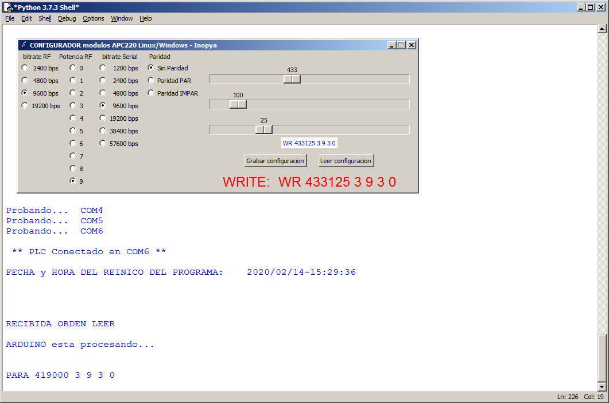

# APC220_GUI_config
***Configurador para APC220 con interfaz grafica TKinter compatible Linux/Windows***

Sencillo programa en Python/TKinter para facilitar la configuracion de los modulos de comunicaciones APC220 de DFrobot
Como todo en esta vida... surge de la necesidad.

Grabar Arduino UNO (la opcion mas comoda) o cualquier otro arduino, con el 'firmware' que hay en al carpera ARDUINO_firmware.
Ejecuar en el PC el programa python y a "divertirse"

Breve recordatorio de los parametros de confiuracion del módulo:
Cuando se lee la configuracion del modulo se obtiene un linea similar a esta:

####   ***PARAM  AAAAAA B C D E***
####   PARAM  415370 2 9 3 0 
	AAAAAA, es la frecuencia de trabajo del modulo expresada en KHz 
	Puede oscilar entre 418MHz y 455MHz
	- en el ejemplo 415.37MHz 

	B, es la velocidad de transmision de radio frecuencia puede tomar los siguientes valores
	1 (2400bps), 2 (4800bps), 3 (9600bps), 4 (19200bps)
	- en el ejemplo 4800bps 
	
	C, es la potencia de emision, puede tomar valores entre 0 y 9, siendo 9 la mayor potencia
	- en el ejemplo 9 (maxima potencia de emision)
	
	D, velodidad de transferencia entre el modulo y arduino o PC 	, toma valores entre 0 y 6
	0 (1200bps), 1 (2400bps), 2 (4800bps),3 (9600bps), 4 (19200bps), 5 (38400bps), 6 (57600bps)
	- en el ejemplo 9600bps 
	
	E, es el control de paridad de la informacion emitida por RF
	0 (sin control de paridad), 1 (paridad par), 2 (paridad impar)
	- en el ejemplo sin control de paridad
	
para mas detalles consultar el [_datasheet_](./APC220_Datasheet.pdf) que hay en este repositorio o directamente en la pagina del fabricante
https://wiki.dfrobot.com/APC220_Radio_Data_Module_SKU_TEL0005_

Para grabar nuevos parametros en el modulo, selecionar desde la interfaz grafica y pulsar el boton "grabar configuracion"

Comprobar que dicha configuracion ha quedado establecida mediant el boton "leer configuracion"
 
#### Muestra de la interfaz grafica de configuracion

