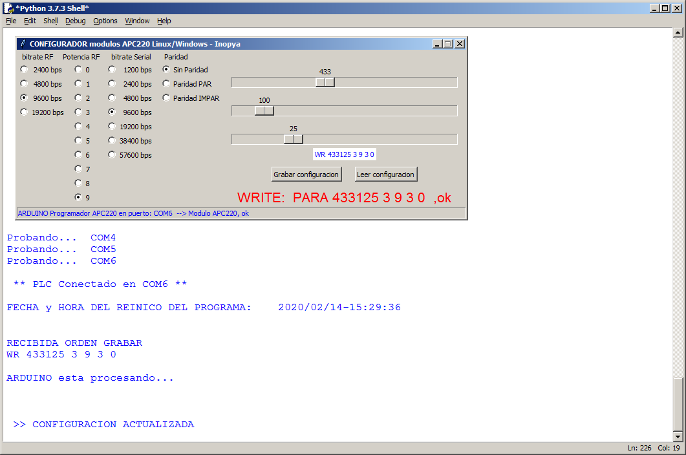

# APC220 GUI config
***Configurador para APC220 con interfaz gráfica TKinter compatible Linux/Windows***

Sencillo programa en Python/TKinter para facilitar la configuración de los módulos de comunicaciones APC220 de DFrobot
Como todo en esta vida... surge de la necesidad.

Grabar Arduino UNO (la opción más comoda debido a que podemos 'pinchar' el APC220 directamente sobre los pines 8a 13) o cualquier otro Arduino, con el 'firmware' que hay en al carpera ARDUINO_firmware.
La conexión entre arduino y el módulo APC220 esta descrita en los comentarios del programa *.ino*
Ejecuar en el PC el programa python y a "divertirse"


Breve recordatorio de los parametros de configuración del módulo:
Cuando se lee la configuración del módulo se obtiene un linea similar a esta:

####   ***PARA  AAAAAA B C D E***
####   PARA  415370 2 9 3 0 
	AAAAAA, es la frecuencia de trabajo del modulo expresada en KHz 
	Puede oscilar entre 418MHz y 455MHz
	- en el ejemplo 415370KHz 

	B, es la velocidad de transmisión de radio frecuencia puede tomar los siguientes valores
	1 (2400bps), 2 (4800bps), 3 (9600bps), 4 (19200bps)
	- en el ejemplo 4800bps 
	
	C, es la potencia de emisión, puede tomar valores entre 0 y 9, siendo 9 la mayor potencia
	- en el ejemplo 9 (máxima potencia de emisión 20mW)
	
	D, velodidad de transferencia entre el módulo y Arduino o PC 	, toma valores entre 0 y 6
	0 (1200bps), 1 (2400bps), 2 (4800bps),3 (9600bps), 4 (19200bps), 5 (38400bps), 6 (57600bps)
	- en el ejemplo 9600bps 
	
	E, es el control de paridad de la informacion emitida por RF
	0 (sin control de paridad), 1 (paridad par), 2 (paridad impar)
	- en el ejemplo sin control de paridad
	
Para más detalles consultar el [_datasheet_](./APC220_Datasheet.pdf) que hay en este repositorio o directamente en la página del fabricante.
https://wiki.dfrobot.com/APC220_Radio_Data_Module_SKU_TEL0005_


Para grabar nuevos parametros en el módulo, selecionar desde la interfaz gráfica y pulsar el botón "Grabar configuración"

Comprobar que dicha configuración ha quedado establecida mediante el botón "Leer configuracion"

***
***Eemplo de la interfaz gráfica del programa junto con la consola python***




***
***Partes de la interfaz grafica***


***
***Interfaz grafica con la opcion radioButton desactivada***

Ejemplo de la intecfaz si se selecciona *FLAG_radioButton = True*
Esto debe hacerse cambiando dicha variable que se encuentra al principio del código Python


***
#  Ejemplos de mensajes durante el uso de programa
***Las siguientes capturas muestran los posibles mensajes y situaciones que nos podemos encontrar durante el uso del programa:***

***
```diff
+Inicio del programa ok, detectado Arduino como programador y APC220 conectado a Arduino
```


***
```diff
+Inicio del programa con error, detectado Arduino pero APC220 no detectado
```


*Sugerencia, si no hemos olvidado conectar el módulo, esperar unos segundos y pulsar sobre el boton "Leer configuración"
para que el programa vuelva a detectar el módulo.*

***
```diff
+Lectura correcta de parametros del APC220
```


***
```diff
+Error en la lectura de parametros del APC220
```


*Sugerencia, si no hemos olvidado conectar el módulo, esperar unos segundos y pulsar sobre el boton "Leer configuración"
para que el programa vuelva a detectar el módulo.*

***
```diff
+Escritura de nuevos parametros en el APC220 realizada correctamente
```


***
```diff
+Error al escribir nuevos parametros en el APC220
```


*Sugerencia, si no hemos olvidado conectar el módulo, esperar unos segundos y pulsar sobre el boton "Leer configuración"
para que el programa vuelva a detectar el módulo.*
